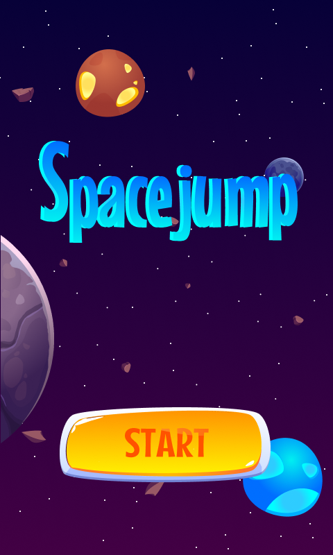
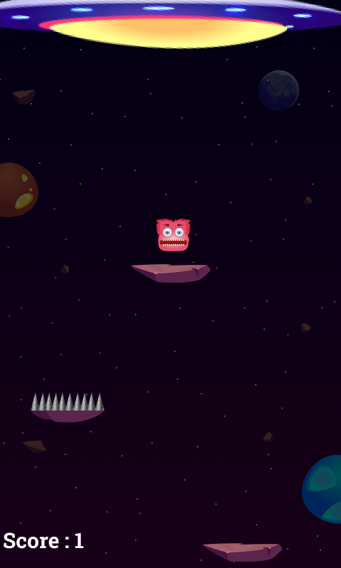

# Space Jump
Game Space Jump ditujukan untuk memenuhi tugas akhir Grafika Komputer.

## Development Team
<table>
  <th>
    Nama
  </th>
  <th>
    Peran
  </th>
  <tr>
    <td>
      Abdullah Aziz Wali (G64180013)
    </td>
    <td>
      Game Programmer
    </td>
  </tr>
  <tr>
    <td>
      Karyadi Mochtar (G64180102)
    </td>
    <td>
      Game Artist
    </td>
  </tr>
  <tr>
    <td>
      Sabrina Diza Melinda (G64180029)
    </td>
    <td>
      Game Designer
    </td>
  </tr>
</table>

## Story line
Spacejump merupakan permainan dimana alien yang harus menghindari tarikan dari UFO asing diatasnya. Alien akan bergerak terus jatuh dan harus bertahan diri agar tidak terjun bebas ke bawah dengan menempatkan diri ke meteor yang sedang bergerak ke atas (tertarik UFO).

## Gameplay
Game ini bertujuan untuk membantu alien agar tidak terjun bebas ke bawah dengan mengarahkannya ke meteor yang sedang bergerak ke atas. Akan tetapi, tidak semua jenis meteor bisa ditempati. Ada jenis meteor yang memiliki daerah tajam di atasnya (spike) sehingga alien harus menghindari meteor tersebut. Setiap alien mendarat di meteor tertentu (standard dan breakable) akan menambah skor pemain.

## Consept & Environtment
Game ini bertemakan luar angkasa dengan tidak memperhatikan tidak adanya gravitasi bumi di luar angkasa. Selama permainan berlangsung, pemain akan diiringi musik tertentu untuk menambah suasan. Adapula backsound ketika terjadi sentuhan antara alien dengan meteor. Terdapat 4 jenis platform yang digunakan, yakni standard platform, breakable paltform (meteor yang akan hancur dalam hitungan detik), spike (meteor yang memiliki duri di bagian atas), dan speed platform (meteor yang bergerak otomatis ke arah sesuai tanda panah). 

## Action
- Pemain hanya bisa mengarahkan alien ke kiri atau ke kanan.
- Alien akan selalu jatuh ke bawah (kecuali saat berada diatas meteor).
- Skor akan bertambah ketika alien bersentuhan dengan standard platform atau breakable platform.

## Teknologi yang digunakan
<table>
  <th>
    Nama Software
  </th>
  <th>
    Fungsi
  </th>
  <tr>
    <td>
      Unity 2019.4.14f1
    </td>
    <td>
      Mengatur pembuatan game, pengolahan aset, penggunaan script, dan kolaborasi
    </td>
  </tr>
  <tr>
    <td>
      Figma
    </td>
    <td>
      Membuat tampilan game
    </td>
</table>

## Screenshot Game

